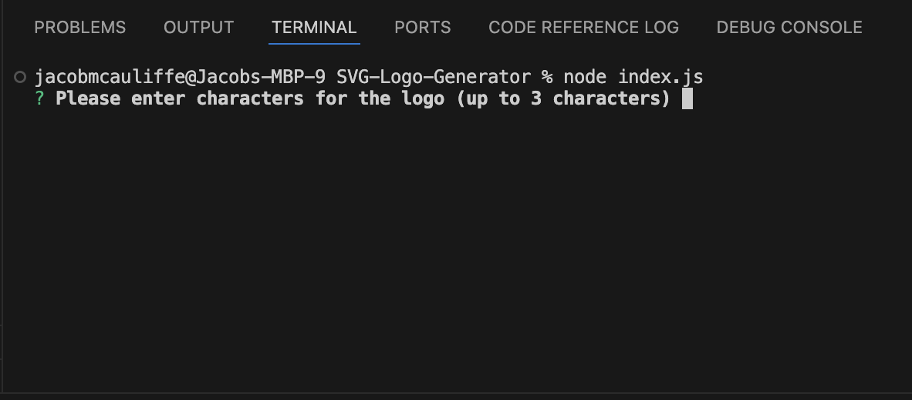
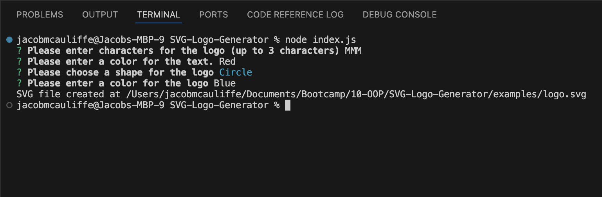

# SVG-Logo-Generator

## Table of Contents
* [Installation](#installation)
* [Description](#description)
* [Usage](#usage)
* [Contributions](#contributions)
* [License](#license)
* [Credits](#credits)
* [Tests](#tests)
* [Questions](#questions)
    
## Installation
To install, please clone this repository to your computer using the following steps:

1. Click the "Code" dropdown menu and copy the SSH URL.
2. Open your terminal and navigate to the directory you would like to clone this repository into.
3. Type "git clone <paste SSH URL>", replacing <paste SSH URL> with your copied SSH URL. You can substitute an SSH URL with an HTTPS URL.
4. Press enter.

## Description
This is a node-based program that generates an SVG logo based on user input into the command line. It utilizes [Inquirer](https://www.npmjs.com/package/inquirer/v/8.2.4) for input collection, and [Jest](https://www.npmjs.com/package/jest) for unit testing.

The program allows the user to input a 3 character text, a color, and a shape. For the shape, the user can pick between a triangle, circle, and square.

An SVG file based on the user's input is then generated in the "examples" folder.

## Usage
To run the program, navigate to the SVG-Logo-Generator folder and enter "node index.js" into your local terminal. Follow the steps as prompted.

Once all the prompts have been answered, a message will be displayed stating the SVG file has been generated. It will also display the pathway to the subdirectory "examples" where your program was generated.

Note - if you generate another SVG after creating your first one, it will overwrite the SVG that already exists in your utils folder. So please save it in a separate folder if you wish to create another one.

To run testing, enter "npm test" into the console.

[Please see this video demo.](https://drive.google.com/file/d/1lxjKyRYxAHUmmB7UXXGlhuHxvugkdOEr/view?usp=drive_link)

## Contributions
When contributing to this repository, please reach out to me via e-mail to discuss the change you would like to make first. I am open to ideas both with regards to new inputs the user can enter to further develop the logo and new tests that can be run.

## License
This project is licensed under the MIT License. For more information, please see the [MIT License](https://opensource.org/licenses/MIT).

## Credits
This program was created by Jacob McAuliffe for the UC Berkeley eDX Coding Boot Camp.

## Tests
In the future, I would like to incorporate other abilities, so users can further customize their SVG logos. Such features could include adding additional text, incorporating images, and even limited animation. Additionally, I'm eager to incorporate the ability to create multiple SVGs without overwriting the initial one in the examples directory.

## Questions
If you have further questions, you can reach me at [mcauliffemedia@gmail.com](mailto:mcauliffemedia@gmail.com).

GitHub Account: [jacobmca](https://github.com/jacobmca)
